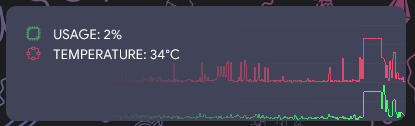
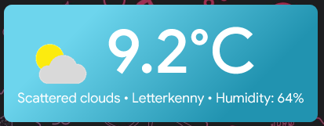

# Conky-Gemini
A Rainmeter Skin set heavily inspired by the system information widgets from **[Conky](https://github.com/brndnmtthws/conky)** I had on a previous ArchLinux notebook, and the *Pollux* style of **TruCola's ["Gemini Suite"](https://www.deviantart.com/trucola/art/The-Gemini-Suite-805582955) Rainmeter skins**.

## Skins Included:

### CPU:

* Shows CPU Usage and Temperature, along with graphs

### MediaPlayer:

* Shows currently playing music.
* Controls only appear on hover, and skin hides if targetted media player process isn't running.
* Web variant supports Spotify via [Spicetify](https://github.com/khanhas/spicetify-cli) patching.

### Network:

* Shows Internal and External IP address for your current network device.
* Shows upload and download speeds, along with graphs.
* Refreshes IP address on left click.

### ShortcutBar:

* Shows icons for each available ShortcutPanel.
* Shows 3 icons by default, with icon spacing set by formula.

### ShortcutPanel:

ShortcutGames

* Shows shortcuts for Games Platforms
* Background changes on hover to match highlighted option

ShortcutInternet

* Shows shortcuts for Internet applications
* Supports background changing on hover to match highlighted option (no images yet)

ShortcutApps

* Same as above, an overflow card for extra applications

### SystemInfo:

* Shows Username, ComputerName, OS Version, Uptime, and your current audio device.
* Audio device changes on left click, mutes on right click, and adjusts volume via scroll wheel.

### SystemUsage:

SystemUsage

* Shows CPU and RAM Usage in a circular graph.
* Shows usage values on hover.

SystemUsageDrives

* Shows drive usage on C: and D: drives.
* Shows free space value on hover.

### Weather:

WeatherDefault

* Scrapes weather information using weatherbit.io
* Shows Temperature, humidity and current weather condition.
* Weather icons are from weatherbit.io's [API Codes page](https://www.weatherbit.io/api/codes)

WeatherGoogle

* A variant using icons based on Google's Material Design and [StarLender](https://www.deviantart.com/starlender)'s original GoogleWeather Rainmeter, rebuilt by me to cover all of weatherbit.io's API codes.

WeatherGreeting

* A variant blatantly ripping off TruCola's WeatherPollux skin
* Features a random greeting pulled from a text file in [@Resources](./@Resources/Text/pollux.txt)
